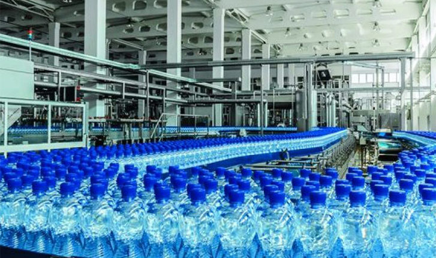

# Haladex-Production-Analysis

# Table of Contents
- [Introduction](#introduction)
- [Business Task](#business-task)
- [Data Source](#data-source)
- [Tools](#tools)
- [Methods](#methods)
- [Graphs](#graphs)
- [Key Observation](#key-observation)
- [Summary of Findings](#summary-of-findings)
- [Recommendations](#recommendation)
- [Codes](#codes)
- [Dashboard](#dashboard)
# Introduction
Haladex Water Production Company is an industry that specializes in the manufacturing and production of satchet and bottled water. During my quest to volunteer as a data analyst for production companies in order to gain hands-on experience in the field, I got a referral from a company I once volunteered for and I was approached by Haladex's manager who expressed interest in having me analyse their production and sales records to determine how sales growth can be enhanced.
